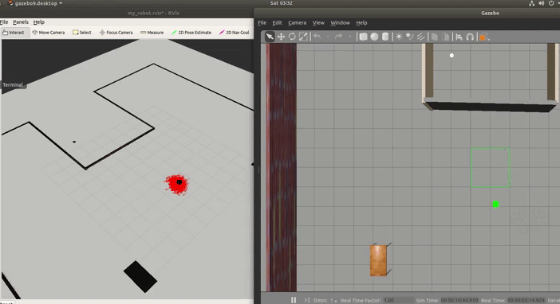

[](https://www.udacity.com/robotics)

# RoboND-Where-Am-I
The **Where-Am-I** is part of RoboND Localization. The purpose is to Utilize the ROS AMCL package and the Tele-Operation / Navigation Stack to localize the robot Explore, add, and tune specific parameters corresponding to each package to achieve the best possible localization results.

# Result


### Directory Structure
```
.RoboND-Where-Am-I
├── ball_chaser
│   ├── CMakeLists.txt
│   ├── launch
│   │   └── ball_chaser.launch
│   ├── package.xml
│   ├── src
│   │   ├── drive_bot.cpp
│   │   └── process_image.cpp
│   └── srv
│       └── DriveToTarget.srv
├── images
│   ├── output.png
│   └── result.gif
├── model
│   ├── Building
│   │   ├── model.config
│   │   └── model.sdf
│   ├── my_ball
│   │   ├── model.config
│   │   └── model.sdf
│   └── table
│       ├── model-1_2.sdf
│       ├── model-1_3.sdf
│       ├── model-1_4.sdf
│       ├── model.config
│       └── model.sdf
├── my_robot
│   ├── CMakeLists.txt
│   ├── config
│   │   ├── base_local_planner_params.yaml
│   │   ├── costmap_common_params.yaml
│   │   ├── global_costmap_params.yaml
│   │   └── local_costmap_params.yaml
│   ├── launch
│   │   ├── amcl.launch
│   │   ├── robot_description.launch
│   │   └── world.launch
│   ├── maps
│   │   ├── map.pgm
│   │   └── map.yaml
│   ├── meshes
│   │   ├── hokuyo.dae
│   │   ├── realsense.dae
│   │   └── wheel.dae
│   ├── package.xml
│   ├── rviz
│   │   └── my_robot.rviz
│   ├── urdf
│   │   ├── my_robot.gazebo
│   │   └── my_robot.xacro
│   └── worlds
│       ├── empty.world
│       └── my_world.world
├── README.md
└── teleop_twist_keyboard
    ├── CHANGELOG.rst
    ├── CMakeLists.txt
    ├── package.xml
    ├── README.md
    └── teleop_twist_keyboard.py
    
```
### Steps to launch the simulation

#### Step 1 Update and upgrade the Workspace image
```sh
$ sudo apt-get update
$ sudo apt-get upgrade -y
```

#### Step 2 Create the catkin workspace
```sh
$ mkdir -p $HOME/catkin_ws/src
$ cd $HOME/catkin_ws/src
$ catkin_init_workspace
$ git clone https://github.com/vinayakkankanwadi/RoboND-Where-Am-I.git
```

#### Step 3 Dependencies for Running Locally
```
 - amcl, move_base, map-server packages.  
 - $ sudo apt-get install ros-<distro>-navigation
 - $ sudo apt-get install ros-<distro>-map-server  
 - $ sudo apt-get install ros-<distro>-move-base  
 - $ sudo apt-get install ros-<distro>-amcl  
 - Used ROS version - melodic
```

#### Step 4 Compile the code
```sh
$ cd $HOME/catkin_ws
$ catkin_make
$ source devel/setup.bash
```

#### Step 5 Run the Simulation 
##### In Terminal 1:

```sh
$ source $HOME/catkin_ws/devel/setup.bash
$ roslaunch my_robot world.launch

The following nodes are launched including amcl, map_server, move_base, rviz
/amcl
/gazebo
/gazebo_gui
/joint_state_publisher
/map_server
/move_base
/robot_state_publisher
/rosout
/rviz

```

##### In Terminal 2:
```sh
$ cd $HOME/catkin_ws
$ source devel/setup.bash
$ rosrun teleop_twist_keyboard teleop_twist_keyboard.py

Robot will localize itself after being tele-operated in the world.

```
##### In Gazebo:
```
Move Robot 
Robot will localize itself after being moved in the world.
```

##### In Rviz:
```
Click 2D Nav Goal 
Robot will localize itself after being given nav_goal target.
```

# License
MIT license
